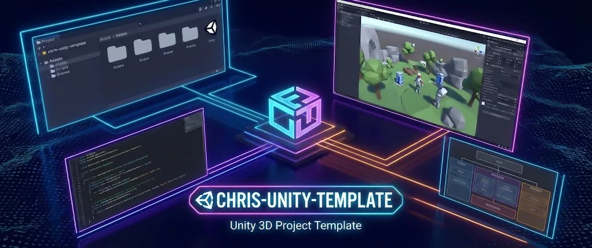

# Chris Unity Template

This template aims to have only the essencial package to start a game project, it includes the [Enigma Core](https://github.com/EnigmaticComma/EnigmaCore) and some useful packages. 

Check what is included in the [manifest.json](https://github.com/Chrisdbhr/chris-unity-template/blob/main/Packages/manifest.json) file!
